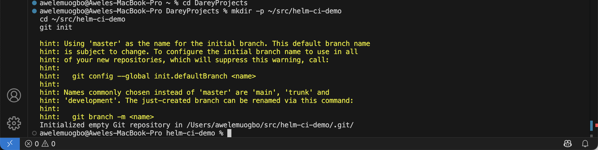
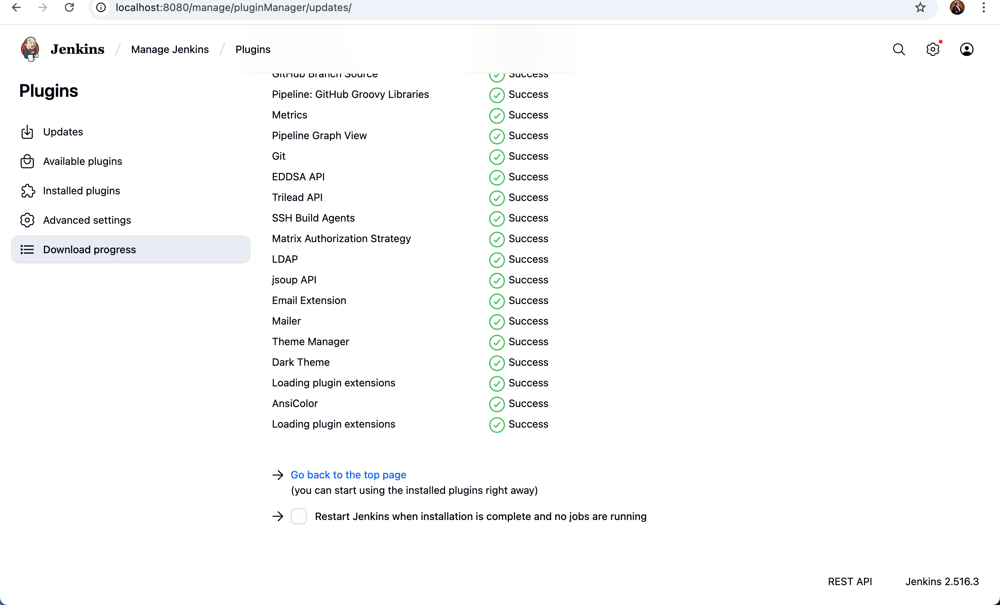
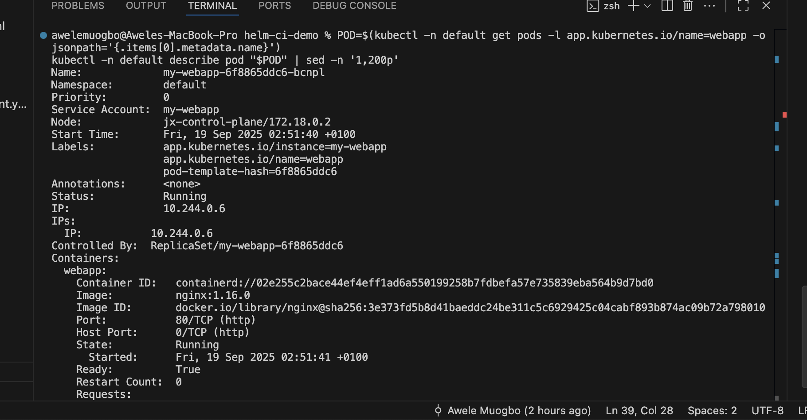
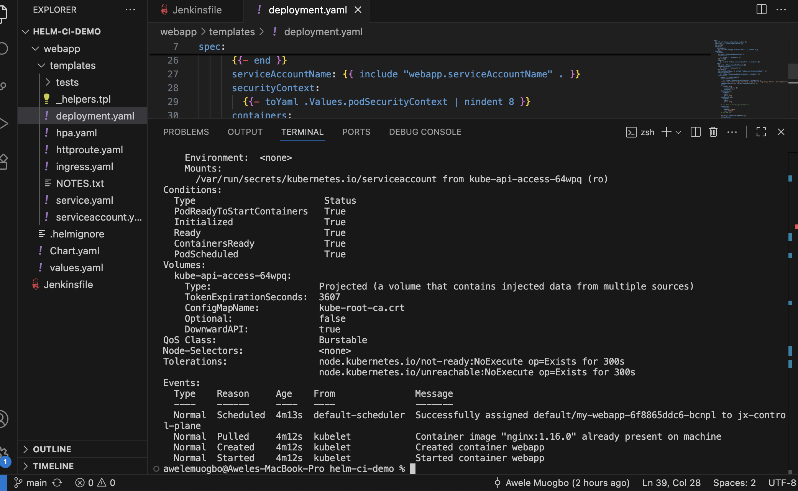

# Integrating-Helm-with-Jenkins

# Project Report: Integrating Helm with Jenkins
## 1. Introduction

This write-up is a thorough, first-person account of how I set up a complete CI/CD pipeline on my Apple-silicon MacBook. The pipeline uses Jenkins to automatically deploy a Helm chart to a local Kubernetes cluster. I describe not only what I did, but also why each choice was made, what broke, how I diagnosed the issues, and exactly how I fixed them. I assume no background knowledge at any stage so that anyone can repeat the process step by step.

The target outcome was simple and measurable: every time I commit and push updates to a Git repository that contains a Helm chart, Jenkins should detect the change and roll out the new version to my Kubernetes cluster. Getting there exposed me to very practical hurdles—slow image pulls, missing plugins, PATH problems, and tool visibility in Jenkins—each of which I resolved methodically.

## 2. Objectives and Success Criteria

1. Stand up a reliable, Apple-Silicon–friendly Kubernetes cluster locally.
2. Install kubectl, Helm, and Jenkins so that Jenkins can invoke them consistently.
3. Create a Git repository with a scaffolded Helm chart named webapp.
4. Configure a Jenkins Pipeline that:

   - Checks out my repository.
   - Runs Helm to install or upgrade the release.
   - Waits for rollout completion and verifies the deployment status.
5. Demonstrate the CI/CD loop by changing the chart (replica count and resource requests), then committing and pushing so Jenkins deploys the change automatically.
6. Triage and fix all issues until the pipeline runs cleanly and repeatedly.

## 3. Environment Overview

Hardware: Apple Silicon MacBook
Operating system: macOS on ARM
Terminal: VS Code integrated terminal (zsh)
Core tooling: Homebrew, Docker Desktop, kind (with Minikube as an alternative), kubectl, Helm, Jenkins LTS, Git, GitHub
Cluster image: kindest/node multi-arch image compatible with ARM64
Jenkins: Homebrew service running as my user account
Source control: GitHub repo containing both the Helm chart and the Jenkinsfile

I kept everything local to simplify networking and credentials. Running Jenkins as my user means it can naturally read \~/.kube/config, which avoids avoidable permission gymnastics.

## 4. Prerequisites Installed and Rationale

1. Xcode Command Line Tools to provide Git and compilers.
2. Homebrew (under /opt/homebrew on Apple Silicon) to install the rest of the CLI tools.
3. Docker Desktop because kind uses Docker containers to host Kubernetes nodes. I allocated at least 4 CPUs and 6–8 GB RAM to Docker for smooth operation.
4. kubectl and Helm for cluster interaction and release management.
5. kind to create a lightweight local Kubernetes cluster that works well on ARM Macs. I also kept Minikube in my back pocket as a fallback.
6. Jenkins LTS via Homebrew so it runs as my user, simplifying file access and environment handling.

## 5. Creating the Cluster

My first attempt was to create a kind cluster with a command that specifies the kindest/node image and a cluster name. Immediately I hit a snag: the process seemed to hang at “Ensuring node image …”.

### 5.1 Challenge: kind appears stuck at “Ensuring node image …”

What was happening:

  - This stage is Docker pulling a large, multi-architecture image. If Docker isn’t fully running, if it’s under-resourced, or if network speed/VPN gets in the way, it looks frozen even though it’s waiting on the image.

What I changed:

- Verified Docker Desktop was up and allocated sufficient resources.
- Confirmed I had enough free disk space (I targeted at least 8–10 GB free).
- Manually ran a docker pull of the node image to see actual download progress and any registry errors.
- When the tag was slow, I tried a newer compatible multi-arch tag. After the image was present locally, kind created the cluster promptly.

Outcome:
The cluster came up successfully. Commands like kubectl cluster-info and kubectl get nodes worked, and my kubeconfig gained a context named kind-jx.

## 6. Installing and Starting Jenkins

I installed Jenkins LTS using Homebrew and started it as a background service. Using the Homebrew service means Jenkins runs under my macOS account, which later allows it to read \~/.kube/config without extra configuration.

I opened Jenkins at [http://localhost:8080](http://localhost:8080), retrieved the initial password from the Jenkins secrets directory, installed the suggested plugins, created my admin user, and confirmed the dashboard was healthy.

## 7. Initializing the Repository and Helm Chart

I created a local project directory, initialized a Git repository, and generated a Helm chart called webapp using the standard Helm scaffolding. The chart contained Chart.yaml, values.yaml, and a templates folder with deployment and service manifests—ideal for a demonstration.

I pushed the repo to GitHub and added a Jenkinsfile at the root so the pipeline configuration would live alongside the code and remain versioned.

## 8. Setting Up the Jenkins Pipeline Job

I created a Pipeline job in Jenkins that reads the Jenkinsfile from SCM. For the first iteration, I used Poll SCM on a short schedule rather than a webhook, so I didn’t have to expose my local Jenkins instance externally. This was enough to validate the entire CI/CD flow.

## 9. Writing the Jenkinsfile and the First Compilation Error

My starting Jenkinsfile included the option ansiColor('xterm') for colored logs. The very first run failed during compilation with “Invalid option type 'ansiColor'”.

### 9.1 Challenge: Pipeline failed with “Invalid option type 'ansiColor'”

Root cause:

  - ansiColor is not a built-in Declarative option; it’s provided by the AnsiColor plugin. Without the plugin, the pipeline compiler rejects the option.

Fix:

  - Two routes are available: install the AnsiColor plugin or remove the option. I removed the line and kept timestamps() to proceed quickly. Installing the plugin would also work.

Result:
The pipeline compiled and moved on to executing stages.

## 10. The kubectl Discovery Problem

Next the console showed “kubectl: command not found” and the build failed with exit code 127. Helm succeeded because I referenced it by absolute path, but kubectl failed because PATH inside Jenkins didn’t include /opt/homebrew/bin.

### 10.1 Challenge: Jenkins didn’t know where kubectl lived

Key insight:

- On Apple Silicon, Homebrew installs into /opt/homebrew/bin. Jenkins executes sh steps in a non-login shell that does not automatically source my interactive shell config. So relying on PATH is unreliable.

What I did:

- Declared two environment variables in the Jenkinsfile: HELM\_BIN=/opt/homebrew/bin/helm and KUBECTL\_BIN=/opt/homebrew/bin/kubectl.
- Set KUBECONFIG="\${HOME}/.kube/config" so Jenkins talks to the same cluster I use in my terminal.
- As an extra precaution, I prepended /opt/homebrew/bin to PATH in the Jenkinsfile environment block.

Result:
The subsequent build printed both binaries’ paths, showed their versions, displayed the current cluster context, listed namespaces, and progressed to linting and deployment.

## 11. Deploying with Helm and Making Meaningful Chart Changes

With the environment corrected, the pipeline ran helm upgrade --install with --wait and a sensible timeout. To prove that CI/CD was actually pushing changes, I updated two things in the chart:

1. values.yaml: set replicaCount to 3 to scale the deployment.
2. templates/deployment.yaml: added a resources.requests block so each pod requested 120m CPU and 180Mi memory.

I committed and pushed those edits. Poll SCM detected the commit, Jenkins rebuilt, and Helm performed an upgrade. The wait flag ensured Jenkins didn’t finish until the rollout was complete or failed.

Verification steps:
I queried the cluster with kubectl to confirm three desired and running replicas, then inspected a pod’s description to verify the requested CPU and memory values. Finally, I checked rollout status to make sure the deployment was available.

## 12. Anticipated Pitfalls and How I Prepared for Them

1. YAML and templating mistakes. YAML is unforgiving. I kept indentation consistent and ran helm lint to catch issues early.
2. Rollout not completing. If readiness fails or an image is wrong, the pipeline times out. My triage process is to describe the deployment and pods and examine logs to pinpoint the cause.
3. Permissions in multi-user clusters. In shared or production environments, I would create a dedicated service account and narrow RBAC permissions, then provide Jenkins with that kubeconfig. For a local cluster, using my personal kubeconfig was fine.
4. Webhooks versus polling. Polling was sufficient for development. For instant builds later, I’ll switch to a webhook and expose Jenkins appropriately.
5. Alternate local cluster. If kind image pulls are slow due to network constraints, Minikube with the Docker driver is a drop-in local alternative.

## 13. The Final Jenkinsfile Design (What It Does)

The final pipeline does the following:

1. Pins absolute paths to helm and kubectl so PATH quirks never break builds.
2. Sets KUBECONFIG so Jenkins uses the intended cluster context.
3. Checks out the repository.
4. Prints tool versions and the active Kubernetes context for quick diagnostics.
5. Lints the chart to catch problems early.
6. Deploys with helm upgrade --install and waits for readiness.
7. Validates the outcome with kubectl by listing resources and checking rollout status.

The declarative structure keeps the flow easy to read and makes failures obvious by stage.

## 14. Verifying the Whole Flow

I validated correctness in three layers:

1. Structural: The pipeline compiled and printed the expected tool paths and versions, proving Jenkins could see the binaries and kubeconfig.
2. Functional: Helm upgraded the release and waited for the rollout to succeed.
3. Behavioral: Changing replicas and resource requests triggered an automatic redeploy, which I confirmed via kubectl commands and pod descriptions.

## 15. Going Beyond the Basic Requirements

I enhanced the solution in several ways:

1. Hardened reliability with absolute binary paths and an explicit KUBECONFIG to eliminate environment ambiguity.
2. Added a “Tooling sanity” stage that surfaces versions, paths, and context, turning the console log into a self-contained diagnostic artifact.
3. Considered production-grade security by planning a service account and RBAC approach for non-local clusters.
4. Documented operational strategies for slow kind image pulls, including resource tuning, manual pre-pulls, trying newer multi-arch tags, and using Minikube as a backup.
5. Included linting and used wait and timeout to force deterministic outcomes in CI, rather than reporting success while the cluster is still converging.

## 16. Detailed Feedback on Obstacles and Resolutions

Challenge: kind cluster creation appeared to stall while ensuring the node image
Resolution: Verified Docker Desktop status and resources, checked disk space, manually pulled the image to observe progress, tried an alternate compatible tag, and restarted Docker when necessary. The root issue was image retrieval, not kind itself.

Challenge: Jenkins pipeline compilation error due to ansiColor in options
Resolution: Understood that ansiColor is a plugin feature. I removed it and kept timestamps only. Installing AnsiColor would also have resolved it. This clarified the difference between built-in options and plugin-provided ones.

Challenge: kubectl not found during build
Resolution: Recognized that Jenkins shells are non-interactive and don’t automatically include /opt/homebrew/bin on PATH. I used absolute paths for both helm and kubectl, set KUBECONFIG explicitly, and prepended Homebrew’s bin directory to PATH in the pipeline. This was the key reliability improvement.

Challenge: Ensuring my chart edits actually produced a new rollout
Resolution: I changed replicaCount and added resource requests so the effects were visible. Jenkins re-deployed, and kubectl confirmed three replicas and the requested CPU/memory on the pods. This proved the CI/CD loop was functional and not superficial.

## 18. Recommendations for Next Steps

1. Replace Poll SCM with GitHub webhooks for instantaneous builds and fewer SCM scans.
2. Introduce a dedicated Kubernetes service account with restricted RBAC and store its credentials in Jenkins, switching the pipeline to use those credentials securely.
3. Parameterize environments (dev, stage, prod) with namespaces and values files, and insert an approval step before promotions.
4. Add post-deploy smoke tests that hit an endpoint to validate functionality, not just readiness.
5. Archive Helm output and kubectl summaries as build artifacts for auditing and troubleshooting.
6. Implement automatic rollback using helm rollback if rollout status fails.

the images below depicts this 

## 19. Conclusion

I delivered a working Jenkins-to-Helm CI/CD pipeline on my Apple-silicon Mac. After untangling realistic setup issues—slow kind image pulls, a missing plugin option, and PATH/kubeconfig discovery inside Jenkins—the pipeline now lints, upgrades or installs with Helm, waits for readiness, and verifies with kubectl. I designed the Jenkinsfile to be resilient on macOS by pinning absolute paths and KUBECONFIG, which removed the most common environment pitfalls.

Beyond producing a functional result, I established habits that make pipelines dependable: log tool and context info up front, fail fast on rollout problems, verify with concrete kubectl queries, and treat the CI environment as a clean room that must be configured explicitly. I am sincerely thankful to Darey.io for the opportunity to implement and reflect on this project in depth and for giving me the nudge to go further than the basic brief.
